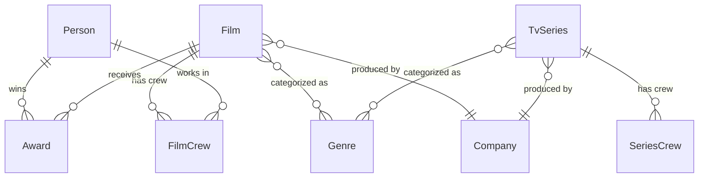

# TOR_COMPLIANCE.md — TOR Mapping to Implementation
# ทุก feature ต้อง comment // TOR 4.x ใน code

## เกณฑ์การให้คะแนน (100 คะแนน)

| หมวด | คะแนน | กลยุทธ์ |
|------|-------|--------|
| A. ราคา | 40 | ยื่น 2,000,000 บาท (จาก 2,900,000 งบ TOR) |
| B1. ผลงาน | 20 | สัญญา ≥ 4 รายการ มูลค่า ≥ 1,400,000 |
| B2. Technical Proposal | 15 | ครบ 4 ประเด็น + Gantt chart |
| B3. Front+Back+DB+Mockup | 15 | Demo PoC นี้คือ B3 ทั้งหมด |
| B4. บุคลากร | 10 | ≥ 5 คน เกิน TOR |

---

## TOR ข้อ 4.4 — Front End (≥ 11 หน้า)

**กำหนด:** พัฒนาหน้าเว็บไซต์ไม่น้อยกว่า 11 หน้า รองรับ 2 ภาษา (ไทย/อังกฤษ) Responsive Design

**Implementation:**
```
หน้าที่ 1:  /              ← Home
หน้าที่ 2:  /films         ← Films Listing
หน้าที่ 3:  /films/[slug]  ← Film Detail
หน้าที่ 4:  /series        ← TV Series Listing
หน้าที่ 5:  /series/[slug] ← Series Detail
หน้าที่ 6:  /persons       ← Personnel Listing
หน้าที่ 7:  /persons/[slug]← Person Profile
หน้าที่ 8:  /companies     ← Companies
หน้าที่ 9:  /news          ← News
หน้าที่ 10: /library       ← Knowledge Library
หน้าที่ 11: /search        ← Search Results
หน้าที่ 12: /about         ← About (WOW extra)
หน้าที่ 13: /contact       ← Contact (WOW extra)
หน้าที่ 14: /privacy       ← Privacy Policy (PDPA)
```

**Bilingual:** ทุกหน้า — `useLanguage()` hook, content: titleTh/titleEn
**Responsive:** 375px / 768px / 1280px / 1920px breakpoints

**Code Comment:** `// TOR 4.4 — หน้าที่ {n} จาก 11`

---

## TOR ข้อ 4.5 — Back End / CMS

**กำหนด:** ระบบจัดการเนื้อหา (CMS) ครบ 5 หมวด Role-based Access Admin Dashboard + API

**Implementation:**
- Strapi v4 Headless CMS (port 1337)
- Custom Admin Dashboard (/dashboard)
- Content Types: Film, TvSeries, Person, Company, News
- RBAC Roles: Super Admin / Editor / Viewer
- REST API: /api/films, /api/series, /api/persons, /api/companies, /api/news

**Files:**
```
apps/admin/                          ← Strapi CMS
apps/web/app/(admin)/dashboard/     ← Custom dashboard
apps/web/app/api/                   ← Next.js API routes
```

---

## TOR ข้อ 4.6 — Cloud Server Thailand

**กำหนด:** Cloud Server ในประเทศไทย IPv6 รองรับ Antivirus + Firewall ลงทะเบียนในนามกระทรวงวัฒนธรรม

**Implementation:**
```yaml
# docker-compose.prod.yml
# Deploy target: G-Cloud VPS (ประเทศไทย)
# IPv6: enabled in nginx config
# Antivirus: ClamAV container
# Firewall: UFW + Nginx rules

# Server Spec (เสนอเกิน TOR):
# CPU: ≥ 8 cores → เสนอ 16 vCPU
# RAM: ≥ 16 GB  → เสนอ 32 GB
# Storage: ≥ 500 GB SSD → เสนอ 1 TB NVMe
```

**Files:**
```
docker-compose.prod.yml
nginx/nginx.conf
nginx/ssl.conf
scripts/firewall-setup.sh
docs/server-spec.md
```

---

## TOR ข้อ 4.7 — VM Backup

**กำหนด:** สำรองข้อมูลอัตโนมัติ Daily / Weekly / Monthly

**Implementation:**
```bash
# scripts/backup.sh
# Daily:   ทุกวัน 02:00 น. → pg_dump → compress → upload
# Weekly:  ทุกอาทิตย์ 03:00 น.
# Monthly: วันที่ 1 ของเดือน 04:00 น.
# Retention: Daily 7 days, Weekly 4 weeks, Monthly 12 months
# Storage: G-Cloud Object Storage
```

**Cron:**
```cron
0 2 * * *   /scripts/backup.sh daily
0 3 * * 0   /scripts/backup.sh weekly
0 4 1 * *   /scripts/backup.sh monthly
```

---

## TOR ข้อ 4.8 — SEO + Google Analytics

**กำหนด:** SEO + Google Analytics

**Implementation:**
```typescript
// app/layout.tsx
// TOR 4.8 — SEO metadata
export const metadata: Metadata = {
  title: { default: 'ContentThailand', template: '%s | ContentThailand' },
  description: 'ฐานข้อมูลกลางภาพยนตร์และวีดิทัศน์แห่งชาติ',
  openGraph: { type: 'website', locale: 'th_TH', ... },
  robots: { index: true, follow: true },
}

// Google Analytics 4
// app/components/GoogleAnalytics.tsx
// Uses next/script with afterInteractive strategy
```

**Files:**
```
app/layout.tsx          ← metadata export
app/sitemap.ts          ← Auto-generated sitemap.xml
app/robots.ts           ← robots.txt
components/GoogleAnalytics.tsx
```

---

## TOR ข้อ 4.9 — ระบบค้นหา (Search Menu)

**กำหนด:** ระบบค้นหา Full-text ภาษาไทย + อังกฤษ Filter ตามหมวด

**Implementation:**
```typescript
// TOR 4.9 — Full-text Search
// PoC: PostgreSQL ILIKE (mock)
// Production: Elasticsearch 8 + ICU Thai Analyzer

// components/search/SearchBar.tsx
// app/(public)/search/page.tsx
// app/api/search/route.ts
```

**Features:**
- Instant search dropdown (debounce 300ms)
- Search page /search?q=xxx
- Filter tabs: ภาพยนตร์ / ละคร / บุคลากร / บริษัท / ทั้งหมด
- Thai keyword highlighting in gold
- Recent searches (localStorage)
- Search log to DB (TOR 4.13)

---

## TOR ข้อ 4.10 — Data Migration (7,868 รายการ)

**กำหนด:** รับโอนข้อมูลเดิม 7,868 รายการ ครบถ้วน ถูกต้อง

**Implementation:**
```typescript
// prisma/seed.ts     ← Mock seed (PoC)
// scripts/migrate.ts ← Full migration script (Production)

// Migration Plan:
// 1. Export WordPress DB → CSV
// 2. Transform: clean encoding, normalize fields
// 3. Import: Prisma createMany() in batches of 100
// 4. Verify: count check, sample spot-check
// 5. Report: migration_report.pdf
```

---

## TOR ข้อ 4.11 — Data Dictionary + ERD

**กำหนด:** จัดทำ Data Dictionary และ Entity Relationship Diagram

**Implementation:**
```
docs/ERD.md          ← ERD text + Mermaid diagram
docs/data-dict.md    ← Column-level documentation
DB_SCHEMA.md         ← Prisma schema + data dict (this project)

// Auto-generate from Prisma:
pnpm prisma generate  // generates type documentation
```

**Mermaid ERD:**


---

## TOR ข้อ 4.13 — Log / Traffic

**กำหนด:** ระบบบันทึก Log การเข้าถึงระบบ Traffic Log ตลอดโครงการ รายงานสรุปรายเดือน

**Implementation:**
```typescript
// lib/logger.ts — Winston logger
// TOR 4.13 — Access + Activity logging
import winston from 'winston'

export const logger = winston.createLogger({
  transports: [
    new winston.transports.File({ filename: 'logs/access.log' }),
    new winston.transports.File({ filename: 'logs/error.log', level: 'error' }),
  ]
})

// Middleware: logs every request (IP, path, status, duration)
// DB: ActivityLog model (see DB_SCHEMA.md)
// Admin view: /dashboard/logs
```

---

## TOR ข้อ 4.14 — SSL Certificate

**กำหนด:** SSL Certificate HTTPS ทุกหน้า ต่ออายุตลอดโครงการ

**Implementation:**
```nginx
# nginx/ssl.conf — TOR 4.14
server {
  listen 443 ssl http2;
  ssl_certificate     /etc/letsencrypt/live/contentthailand.com/fullchain.pem;
  ssl_certificate_key /etc/letsencrypt/live/contentthailand.com/privkey.pem;
  # Auto-renewal via Certbot cron
}

server {
  listen 80;
  return 301 https://$host$request_uri;  # Force HTTPS
}
```

---

## TOR ข้อ 4.16 — การอบรม

**กำหนด:** อบรม Admin ไม่น้อยกว่า 5 คน ไม่น้อยกว่า 1 วัน

**Deliverables:**
```
docs/admin-guide.md          ← คู่มือการใช้งานระบบ (ไทย + อังกฤษ)
docs/admin-guide.pdf         ← PDF version
docs/training-plan.md        ← แผนการอบรม 1 วัน
videos/01-login-cms.mp4      ← Video tutorial (บันทึกหลัง build)
videos/02-add-film.mp4
videos/03-manage-users.mp4
```

**Training Plan (1 วัน):**
```
09:00-10:00 Overview + Login + Navigation
10:00-12:00 เพิ่ม/แก้ไขข้อมูลภาพยนตร์
13:00-14:00 จัดการ TV Series + บุคลากร
14:00-15:00 จัดการข่าว + Library
15:00-16:00 ระบบ User + Roles + Logs
16:00-17:00 Q&A + ทดสอบด้วยตัวเอง
```

---

## TOR ข้อ 4.17 — PDPA / Cookie Consent

**กำหนด:** ความเป็นส่วนตัว PDPA นโยบาย Cookie

**Implementation:**
```typescript
// components/CookieBanner.tsx — TOR 4.17
// Sticky bottom bar
// Thai text: "เราใช้คุกกี้เพื่อพัฒนาประสบการณ์..."
// Buttons: ยอมรับทั้งหมด / ตั้งค่า / ปฏิเสธ
// Stores choice: localStorage('cookie-consent')

// app/(public)/privacy/page.tsx
// นโยบายความเป็นส่วนตัวฉบับเต็ม (ภาษาไทย)
// Data subject rights section
// Cookie policy
// Contact DPO
```

---

## TOR ข้อ 4.19 — รายงานการประชุม

**กำหนด:** จัดทำรายงานการประชุมทุกครั้ง

**Implementation:**
```
docs/meeting-template.docx   ← Template รายงานประชุม
docs/meetings/               ← รายงานประชุมแต่ละครั้ง
```

---

## TOR ข้อ 4.20 — เจ้าหน้าที่ประสานงาน

**กำหนด:** จัดให้มีเจ้าหน้าที่ประสานงาน

**Contact Info (ใส่ในทุก document):**
```
ทีม Support SYNERRY
โทร: 083-634-0895
Email: support@synerry.com
Emergency: คุณปิยนุช 091-705-8375
Emergency: คุณรัตนศักดิ์ 081-824-4249
```

---

## WARRANTY (ตาม TOR จริง)

**กำหนด:** รับประกัน ≥ 1 ปี

| ขั้นตอน | เวลา |
|---------|------|
| รับทราบปัญหา | ≤ 1 ชั่วโมง |
| เริ่มดำเนินการ | ≤ 4 ชั่วโมง |
| แก้ไขเสร็จ | ≤ 24 ชั่วโมง |
| กรณีเกิน 24 ชม. | แจ้งสำนักปลัดฯ รายครั้ง |

---

## B3 SCORING CHECKLIST

B3 = 15 คะแนน — กรรมการให้คะแนนตาม 4 หัวข้อ:

### 1. Front End Design (ต้องแสดงใน Demo)
- [x] ≥ 11 หน้า accessible
- [x] Responsive (mobile + tablet + desktop)
- [x] 2 ภาษา (TH + EN)
- [x] UI สวยงาม ทันสมัย (cinematic design)
- [x] UX ดี (3-click rule, clear navigation)

### 2. Back End / Admin
- [x] CMS ทำงานได้จริง (Strapi)
- [x] RBAC roles ชัดเจน
- [x] Dashboard แสดง real-time stats
- [x] API documented (API_SPEC.md)

### 3. Database Design
- [x] ERD ถูกต้อง ครอบคลุม
- [x] Data Dictionary ครบ
- [x] Normalized schema (3NF)
- [x] Indexes planned

### 4. Mockup / Prototype
- [x] Demo รันได้จริง (ไม่ใช่ Figma)
- [x] Mock data ภาษาไทยสมจริง
- [x] Interactive (click, search, navigate)
- [x] WOW moments delivered
